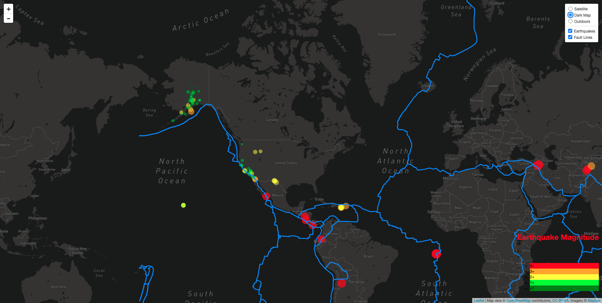
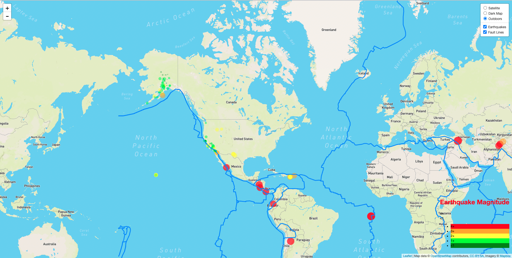
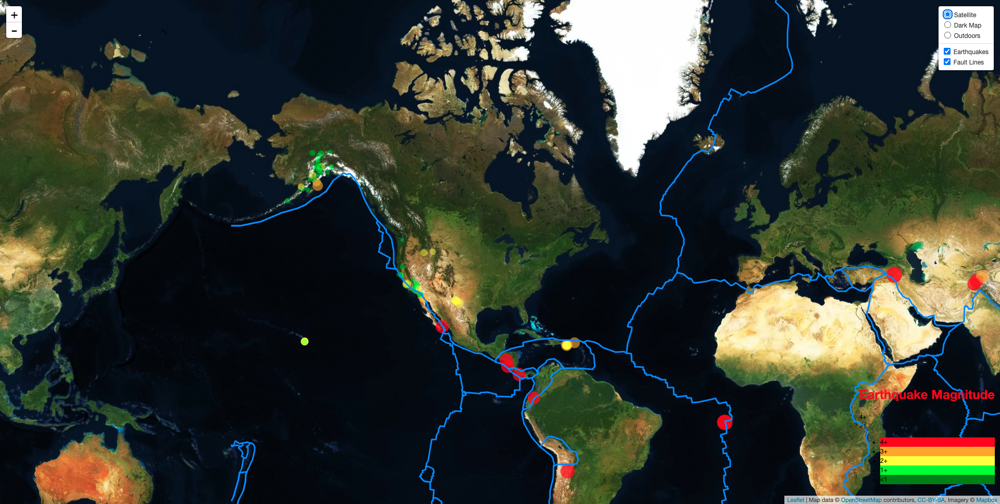

# leaflet-challenge

## Target

Visualize U.S. Geological Survey data on earthquakes to better understand Earthquakes.<br/>

**_Web page image_**<br/>

* Dark Map<br/>
.<br/>

* OutDoor Map<br/>
* .<br/>

* Satellite Map<br/>
* .<br/>

## Step by Step Approch

### Step 1 Basic Visualisation

1. **Get your data set**
    ``` python
    var queryUrl =
      "https://earthquake.usgs.gov/earthquakes/feed/v1.0/summary/all_day.geojson";
    var geoJson;
    d3.json(queryUrl).then(function (data) {
      createFeatures(data.features);
    });
    ```

2. **Import & Visualise the Data**

   * Your data markers should reflect the magnitude of the earthquake in their size and colour. Earthquakes with higher magnitudes should appear larger and darker in colour.<br/>
     ``` python
     // Set up color of mark
        function markerColor(magnitude) {
          if (magnitude <= 1) {
            return "green";
          } else if (magnitude <= 2) {
            return "lime";
          } else if (magnitude <= 3) {
            return "yellow";
          } else if (magnitude <= 4) {
            return "orange";
          } else {
            return "red";
          }
        }
        //  Set up transparency
        function markerOpacity(magnitude) {
          if (magnitude <= 1) {
            return 0.3;
          } else if (magnitude <= 2) {
            return 0.4;
          } else if (magnitude <= 3) {
            return 0.5;
          } else if (magnitude <= 4) {
            return 0.6;
          } else if (magnitude <= 5) {
            return 0.7;
          } else if (magnitude <= 6) {
            return 0.8;
          } else if (magnitude <= 7) {
            return 0.9;
          } else {
            return 1;
          }
        }
     ```

   * Include popups that provide additional information about the earthquake when a marker is clicked.<br/>
     ``` python
     // Create the popup
        function createPopup(feature, layer) {
          return layer.bindPopup(
            "<h3>" +
              feature.properties.place +
              "</h3><hr><p>" +
              new Date(feature.properties.time) +
              "</p><hr><p>Magntude:" +
              feature.properties.mag +
              "</p>"
          );
        }
     ```

   * Create a legend that will provide context for your map data.<br/>
     ``` python
       // Set up the legend
      var legend = L.control({ position: "bottomright" });
      legend.onAdd = function () {
        var div = L.DomUtil.create("div", "info legend");
        var limits = ["4+", "3+", "2+", "1+", "<1"];
        var colors = ["red", "orange", "yellow", "lime", "green"];
        var labels = [];

      // Add min & max
      var legendInfo =
        '<h1 style="color:red">Earthquake Magnitude</h1>' +
        '<div class="labels">' +
        '<div class="min">' +
        limits[0] +
        "</div>" +
        '<div class="max">' +
        limits[limits.length - 1] +
        "</div>" +
        "</div>";

      div.innerHTML = legendInfo;
      //  push the color and label to the legend
      limits.forEach(function (limit, index) {
        labels.push(
          `<li style="background-color: ${colors[index]}">${limit}</li>`
        );
      });
      div.innerHTML += "<ul>" + labels.join("") + "</ul>";
      return div;
      };
      legend.addTo(myMap);
     ```
- - -

### Step 2 More Data (Optional)

* Plot a second data set on our map.<br/>
  ``` python
    var Satellite = L.tileLayer(
      "https://api.mapbox.com/styles/v1/{id}/tiles/{z}/{x}/{y}?access_token={accessToken}",
      {
        attribution:
          'Map data &copy; <a href="https://www.openstreetmap.org/">OpenStreetMap</a> contributors, <a href="https://creativecommons.org/licenses/by-sa/2.0/">CC-BY-SA</a>, Imagery © <a href="https://www.mapbox.com/">Mapbox</a>',
        maxZoom: 18,
        id: "mapbox/satellite-v9",
        tileSize: 512,
        zoomOffset: -1,
        accessToken: API_KEY1,
      }
    );

    var darkmap = L.tileLayer(
      "https://api.mapbox.com/styles/v1/{id}/tiles/{z}/{x}/{y}?access_token={accessToken}",
      {
        attribution:
          'Map data &copy; <a href="https://www.openstreetmap.org/">OpenStreetMap</a> contributors, <a href="https://creativecommons.org/licenses/by-sa/2.0/">CC-BY-SA</a>, Imagery © <a href="https://www.mapbox.com/">Mapbox</a>',
        maxZoom: 18,
        id: "mapbox/dark-v10",
        tileSize: 512,
        zoomOffset: -1,
        accessToken: API_KEY1,
      }
    );

    var Outdoors = L.tileLayer(
      "https://api.mapbox.com/styles/v1/{id}/tiles/{z}/{x}/{y}?access_token={accessToken}",
      {
        attribution:
          'Map data &copy; <a href="https://www.openstreetmap.org/">OpenStreetMap</a> contributors, <a href="https://creativecommons.org/licenses/by-sa/2.0/">CC-BY-SA</a>, Imagery © <a href="https://www.mapbox.com/">Mapbox</a>',
        maxZoom: 18,
        id: "mapbox/outdoors-v11",
        tileSize: 512,
        zoomOffset: -1,
        accessToken: API_KEY1,
      }
    );
  ````

* Add a number of base maps to choose from as well as separate out our two different data sets into overlays that can be turned on and off independently.<br/>
  ``` python
    //create separate layer groups
    var baseMaps = {
      Satellite: Satellite,
      "Dark Map": darkmap,
      Outdoors: Outdoors,
    };

    var overlayMaps = {
      Earthquakes: earthquakes,
    };

    var myMap = L.map("map", {
      center: [44.5, -89.5],
      zoom: 3,
      layers: [darkmap, earthquakes, Outdoors],
    });
  ```
* Add layer controls to our map.<br/>
  ``` python
    L.control
      .layers(baseMaps, overlayMaps, {
        collapsed: false,
      })
      .addTo(myMap);
  ```
- - -

  ## Files
  [output](/OutPut)<br/>
  - DarkMap_full_screenshot.png<br/>
  - OutDoor_full_screenshot.png<br/>
  - SatelliteMap_full_screenshot.png<br/>

  [index.html](/index.html)<br/>

  [Leaflet-Step-1](/Leaflet-Step-1)<br/>
  - static<br/>
    - css<br/>
      - style.css<br/>
    - js <br/>
      - logic.js<br/>
 
  [Leaflet-Step-2](/Leaflet-Step-2)<br/>
  - static<br/>
    - css<br/>
      - style.css<br/>
    - js <br/>
      - logic.js<br/>

